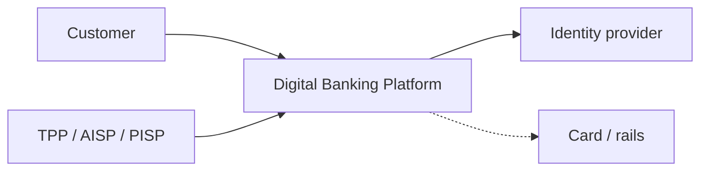
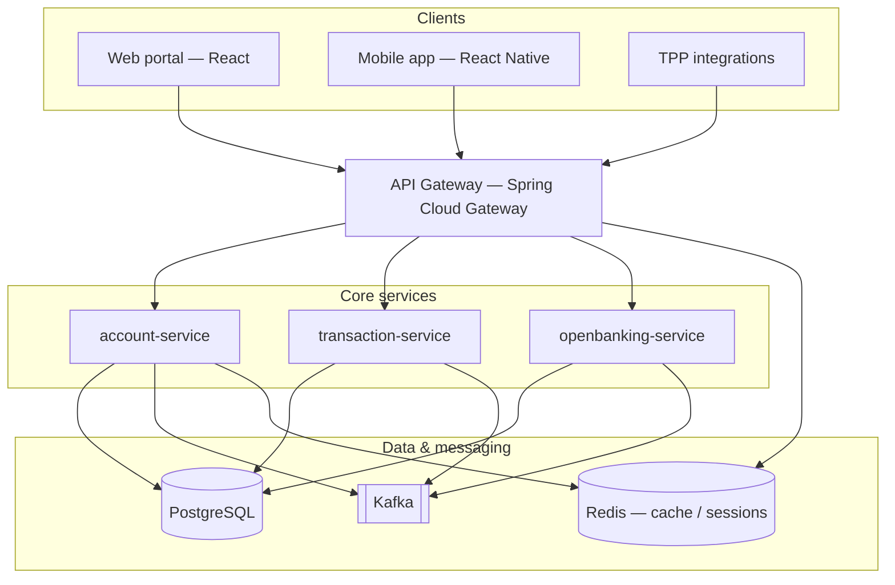
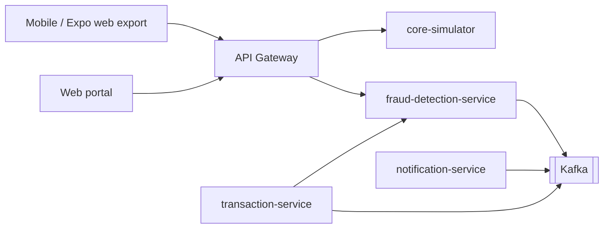

# High-level design

This document captures the **system context** and **container** view for the digital banking platform using C4-style diagrams (Mermaid).

## System context

Customers and third-party providers interact with the bank through digital channels. Internal staff may use operational tooling (out of scope for Day 1).

## Container diagram

## Key components

| Component | Responsibility |
|-----------|----------------|
| **account-service** | Party/account aggregates, balances (read models), product configuration |
| **transaction-service** | Posting engine interface, payment initiation records, idempotent commands |
| **openbanking-service** | Consent registry, AIS/PIS façade, TPP registry hooks |
| **API gateway** | Routing, cross-cutting concerns (rate limits, tracing headers — to be expanded) |
| **PostgreSQL** | System of record for transactional data (per-service schemas or databases) |
| **Kafka** | Domain events, integration with fraud/ledger/async workflows |
| **Redis** | Hot read cache, optional session/token blocklists |

## Non-functional notes (Day 1)

- **Observability**: Standardize on OpenTelemetry-compatible traces and structured logs in later days.
- **Deployment**: Local Docker Compose now; Kubernetes under `infrastructure/k8s/` for cluster targets.
- **Environments**: Dev uses H2 optional profile; Compose uses PostgreSQL with the `docker` Spring profile.

## Day 3 — Omni-channel, core simulator, fraud

- **Channel validation**: Clients send `X-Client-Id` and `X-Client-Channel` (enforced in Docker via the gateway). Optional `X-Device-Id` is forwarded for fraud rules.
- **Core banking**: `core-simulator` exposes REST ledger/customer stubs; `account-service` enriches `GET /api/accounts/{id}` with core fields and uses Resilience4j circuit breakers when the simulator is unavailable.
- **Fraud**: `transaction-service` calls `fraud-detection-service` synchronously before completing a transaction; Kafka listeners still process `TransactionCreated` for async scoring. Amount and device fingerprint rules apply; `BLOCK` returns HTTP 403.
- **Caching**: Account reads use Spring Cache with Redis (60s TTL) in Docker; balance updates evict the cache entry.
- **Gateway resilience**: Resilience4j circuit breakers on routed services with JSON fallback payloads from `/fallback/*`.
