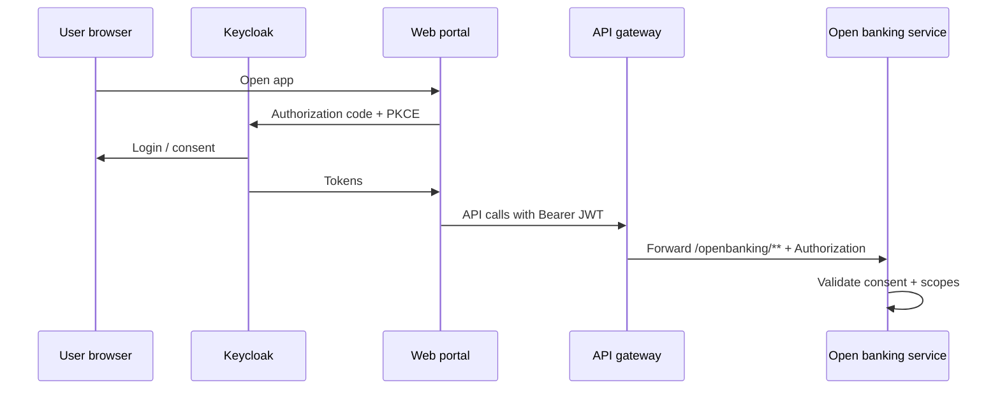

# Open banking strategy

## PSD2 alignment (conceptual)

The platform is designed to support **Account Information Services (AIS)** and **Payment Initiation Services (PIS)** with explicit **customer consent**, strong customer authentication (SCA), and secure TPP identification — consistent with PSD2-style regulation (exact jurisdictional rules to be confirmed with legal/compliance).

## AIS / PIS APIs

| Stream | Purpose | Example capabilities |
|--------|---------|----------------------|
| **AIS** | Read balances, transactions, account metadata | Consent-scoped account list, transaction history with pagination |
| **PIS** | Initiate payments from funded accounts | Single immediate payment, status polling, refund/cancellation policies |

Implementation exposes REST under **`/openbanking/**`** (routed via the API gateway). Core services remain under **`/api/**`**. Idempotency keys on mutating calls are planned for a later iteration.

## Day 2 HTTP API (implemented)

Base URL in development: `http://localhost:8080` (gateway). Replace `{id}` with UUIDs where applicable.

### Consent

| Method | Path | Description |
|--------|------|-------------|
| `POST` | `/openbanking/consents` | Create consent. Body: `customerId`, `tppId`, `scopes` or `permissions` (string list), optional `validFrom`, `validTo` or alias `validUntil`. |
| `GET` | `/openbanking/consents/{id}` | Fetch consent by id. |
| `DELETE` | `/openbanking/consents/{id}` | Revoke consent. |

### AIS (Account Information)

| Method | Path | Description |
|--------|------|-------------|
| `GET` | `/openbanking/accounts` | Accounts for which there is **active** consent for the TPP/customer in context. Requires scope `accounts:read` on the token (or demo headers — see open banking service). |
| `GET` | `/openbanking/accounts/{accountId}/transactions` | Transaction history for a consented account. Requires `transactions:read`. |

### PIS (Payment Initiation)

| Method | Path | Description |
|--------|------|-------------|
| `POST` | `/openbanking/payments` | Initiate payment (creates a downstream transaction). Requires `payments:write`. |

### Core banking (behind gateway)

| Method | Path | Description |
|--------|------|-------------|
| `POST` | `/api/accounts` | Create account. |
| `GET` | `/api/accounts` | List all accounts (ops / smoke; tighten for production). |
| `GET` | `/api/accounts/{id}` | Account by id. |
| `GET` | `/api/accounts/customer/{customerId}` | Accounts for customer. |
| `POST` | `/api/accounts/{id}/balance` | Internal balance adjustment. |
| `POST` | `/api/transactions` | Create transaction (PENDING). |
| `POST` | `/api/transactions/{id}/complete` | Complete transaction (balance update + events). |
| `GET` | `/api/transactions/account/{accountId}` | List transactions for account. |

### OpenAPI

Formal OpenAPI YAML generation is not wired in CI for Day 2; contract-first specs can be added under `docs/api/` in a follow-up.

## OAuth2 / OIDC flows

- **Authorization Code + PKCE** for interactive customer consent (web/mobile). The **web-portal** uses **Keycloak JS** when `REACT_APP_KEYCLOAK_URL` is set; realm `digital-banking`, public client `web-portal` (see `infrastructure/keycloak/digital-banking-realm.json`).
- **Client credentials** (with mTLS or private key JWT) for confidential TPP server-to-server where applicable. A mock confidential client **`tpp-demo`** is seeded for lab use (rotate the secret outside demos).
- **Scopes** map to consent artifacts (e.g. `accounts:read`, `transactions:read`, `payments:write`). The **ConsentValidationFilter** in `openbanking-service` checks JWT `scope` (and `azp` / `sub` as TPP hint) or **demo headers** `X-Demo-Tpp-Id` / `X-Demo-Customer-Id` for local testing without a full TPP token.
- **Tokens** are short-lived; **refresh** only where product policy allows; bind tokens to **consent IDs** and **TPP client IDs** (enforcement to be tightened in Day 3+).

### Sequence (high level)

## Consent management

- **Consent record**: who (customer), what (scopes, accounts), when (valid from/until), which TPP, revocation status.
- **Lifecycle**: grant, refresh scope (re-auth), revoke, expire; immutable audit trail for regulatory evidence.
- **UX**: Clear disclosure of data access and payment limits before approval.

## Operational controls

- TPP onboarding: registry identifiers, certificates, redirect URI allow lists.
- **Rate limiting**: In Docker profile, the API gateway applies a **Redis** `RequestRateLimiter` to **`/openbanking/**`** (replenish 20 / burst 40 per key resolver). Broader anomaly detection is a later-day topic.
